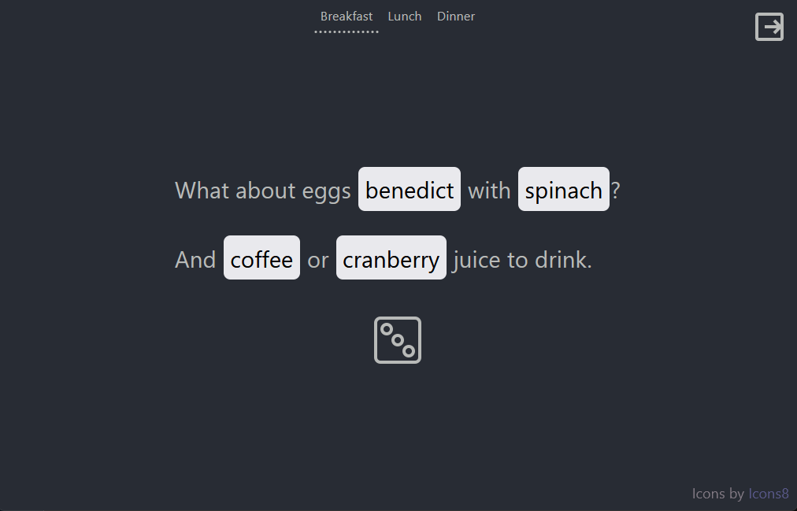

# Configurable Generators

This is a static site that creates random text from a set of generator templates and content tables. It includes a few preconfigured example generators, but is mostly intended to read configuration files provided by the user. That means game makers can distribute their own config files however they want (for example, as a digital supplement to paper-and-dice data tables). It also means the app works completely offline.

## Usage

You can try it out by going to [generators.finn.fun](http://generators.finn.fun) and selecting a preset. This one is Simple Meals:



* Select a generator from the menu at the top.
* Click on any random item (like "benedict" or "spinach") to regenerate just that item.
* Click the die at the bottom to regenerate all the items in the generator.
* You can look at the config files for the presets in [src/static/presets](src/static/presets).

## Config files

The generator config files are plain JSON. [This example](examples/generator-config-template.json) includes all the required elements:

```json
{
  "title": "Config Template",
  "schemaVersion": "0.1.0",
  "generators": {
    "Example": [
      "Random color: <color>",
      "Another (or possibly the same) random color: <color>"
    ],
    "Example 2": [
      "An animal: <animal>"
    ]
  },
  "tables": {
    "color": [
      "red",
      "green",
      "blue"
    ],
    "animal": [
      "duck",
      "ibex",
      "orangutan"
    ]
  }
}
```

There are also some optional top-level keys:

* You can add a short description in the `"description"` key to display some text in the lower left, like who made the config and what it's for.
* Put a URL in `"link"` to add a link after (or instead of) the description. This is handy for connecting the config to the game it was made for.
* If the generator content refers to something which updates sometimes, you can use the `"contentVersion"` key to track what version this configuration is for.
  * Not to be confused with `"schemaVersion"` which is for the version of the configuration format itself.

## License

You're free to use, copy, and modify this code under the terms of the [MIT license](LICENSE).

## Contributing

### Building the app

See [Create React App](https://github.com/facebook/create-react-app)'s docs. TL;DR:

* clone the repository
* `npm install` to install dependencies
* `npm start` to run a dev instance locally.
* `npm run build` to package the app for deployment.

### Deploying the app

If you want to deploy your own copy of this repo on an S3 static site, here are the broad strokes of what you'll need:

#### In AWS

* make an S3 bucket
  * if you want to point your domain at it, name the bucket whatever the domain address will be (like `generators.finn.fun`).
  * enable public access
  * enable static site with index.html as the root page
  * add a policy that allows anonymous users to `s3:getObject`
* make an IAM user
  * generate a set of security credentials and store them somewhere safe
  * as a more secure alternative, you can [set up OIDC](https://docs.github.com/en/actions/deployment/security-hardening-your-deployments/configuring-openid-connect-in-amazon-web-services)
* make an IAM role that allows `s3:putObject` in the bucket
  * a trust policy that allows the IAM user to `sts:assumeRole` and `sts:tagSession` on the role

#### In your registrar

If you're setting up a custom domain, create a CNAME record that points to the static site URL of your S3 bucket. For example, my CNAME record on `finn.fun` points to `generators.finn.fun.s3-website-us-west-1.amazonaws.com.` (including the dot at the end, it's important).

#### In GitHub

* fork this repository
* in the new repository's settings, create secrets for the IAM user credentials:
  * `AWS_ACCESS_KEY_ID`
  * `AWS_SECRET_ACCESS_KEY`
  * skip this step if you're using OIDC
* in `.github/workflows/deploy.yml`, update some environment variables:
  * `AWS_ROLE` to the name of the role you created
  * `AWS_BUCKET` to the name of the bucket
  * `AWS_REGION` probably doesn't matter but feel free to set it somewhere closer to you
  * `AWS_SESSION_NAME` can change but doesn't need to, it's there to make AWS logs easier to understand
  * if you're using OIDC, remove the two lines that reference secret credentials

To test it out, go to the Actions tab of the repo, select "Build and deploy" from the list, and "Run workflow." If everything's set up right, in about a minute all the jobs will turn green and your site will be reachable at the S3 static site URL (and your custom domain if you set that up). If not, read the error messages in the log for ideas, and feel free to make an issue if there's a problem with these instructions.

### On the command line

This is completely optional, but if you set up the [GitHub CLI](https://cli.github.com/) you can use this additional npm script:

`npm run deploy`

It calls out to the GitHub workflow, watches the job progress in a terminal, and makes a terminal beep when it's done.
